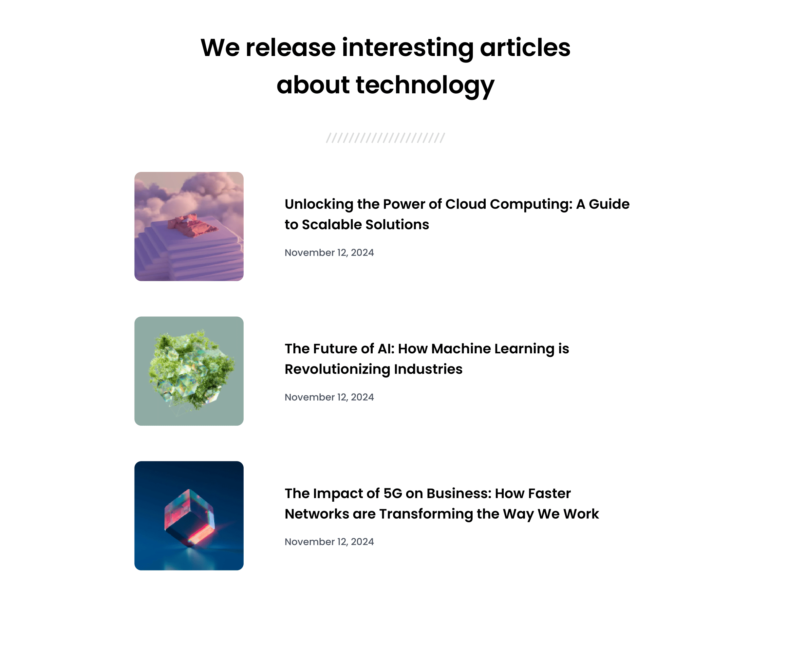

# 📰 Simple Article Listing
Welcome to the **Simple Article Listin** Page project!

A simple and responsive beginner-friendly web development project built with **HTML and CSS**, inspired by **DevChallenges**.

## 📌 Overview  

### The challenge ⚡
Build a responsive **article listing page** that displays multiple articles with images, titles, and publish dates.  
The design should adapt well across desktop, tablet, and mobile screen sizes.


### The page includes 📋
- A main heading with an overview of the articles
- A separator image below the heading
- Multiple articles each containing:
  - An image
  - Article title
  - Publish date
- Responsive design for desktop, tablet, and mobile
- Clean typography using Google Fonts (Poppins)

### Screenshot 📱
  


### Links 🔗
- Solution URL: [GitHub Repository](https://github.com/sameer-srb/simple-article-listing)  
- Live Site URL: [Live Demo](https://simple-articles-listing.netlify.app)


## 💡 My process

### Built with ⚙️
- Semantic **HTML5** markup  
- **CSS3 Flexbox** for layout  
- **Responsive design** with media queries  
- **Google Fonts (Poppins)** for typography  

### What I learned 📑
- How to structure semantic HTML using `<article>`, `<section>`, and `<header>` elements.  
- Improved my understanding of **Flexbox** for horizontal and vertical alignment.  
- Learned to use **media queries** effectively for responsive layouts.  
- Writing clean and meaningful **CSS comments** for maintainability.  

```css
article {
  display: flex;
  gap: 60px;
  align-items: center;
}
```

### Useful resources 📚 
- [MDN Web Docs – HTML](https://developer.mozilla.org/en-US/docs/Web/HTML)  
- [MDN Web Docs – CSS](https://developer.mozilla.org/en-US/docs/Web/CSS) 
- [devChallenges](https://devchallenges.io/challenge/join-our-newsletter)  
- [Google Fonts (Popins)](https://fonts.google.com/specimen/Poppins)


## 🙏 Acknowledgments
Special thanks to **devChallenges** and **MDN Docs** for helpful resources during the development.


## 📬 Feedback
Suggestions or improvements welcome!  
Feel free to open an issue or reach out.

**Author :-**

[](https://www.linkedin.com/in/sameer-barik-a509672ba/) - [](https://github.com/sameer-srb) - [](https://x.com/sameer_srb) 

Created by **SAMEER** - 2025
